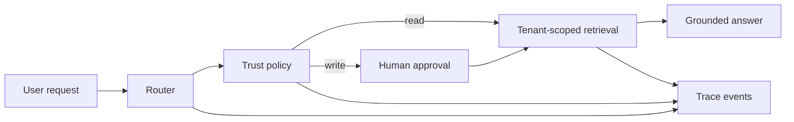

# Agentic RAG Platform Reference

> A runnable, provider-neutral agent platform demonstrating tenant-scoped retrieval, explicit tool approvals, memory isolation, traces, and repeatable evaluations.

**Why it matters:** agent demos are easy; dependable agent systems need evidence, permissions, failure handling, and measurable behavior. This repository is an intentionally small reference that makes those boundaries visible.



## What I built

- A deterministic agent loop with explicit routing and typed trace events.
- Tenant-scoped retrieval and memory that prevent cross-tenant reads.
- Allowlisted tools with approval gates for state-changing actions.
- A 20-task, three-trial evaluation harness covering grounding, routing, isolation, and approvals.
- A zero-credential mock mode suitable for CI and a five-minute technical review.

## Quickstart

```bash
make demo
make test
make eval
```

Python 3.11+ is the only requirement. The default path makes no network requests and costs $0.

## Evaluation contract

`evals/cases.json` defines 20 tasks. Every task runs three times. Code graders verify the expected status, tool, citations, trace steps, and absence of tenant leakage. `make eval` writes the reproducible report to `evals/results.json`.

The publication gate is:

- 100% deterministic security and approval checks.
- At least 85% overall task success.
- Explicit p50/p95 latency and estimated cost.

## Trust boundaries

| Boundary | Enforcement |
|---|---|
| Tenant data | Every document and memory lookup requires `tenant_id` |
| Tools | Only configured tool names may execute |
| Writes | Write/destructive tools require human approval |
| Grounding | Answers expose the exact document IDs used |
| Observability | Routing, policy, retrieval, and outcome steps are traced |

## What is mocked

- The model is deterministic and extractive.
- Retrieval is an in-memory lexical implementation.
- Tools demonstrate policy behavior without touching external systems.

These seams are deliberate: real providers can be added without weakening the trust contract.

## Known limitations

- This is a reference architecture, not a hosted product.
- It does not claim production scale or model quality.
- The offline evaluator measures orchestration behavior, not frontier-model reasoning.

See [SECURITY.md](SECURITY.md) and [PROVENANCE.md](PROVENANCE.md) before reusing the design.
