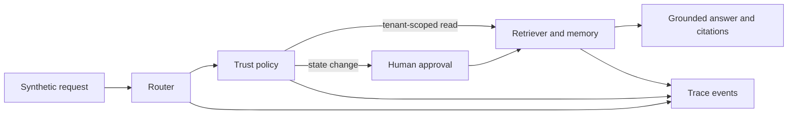
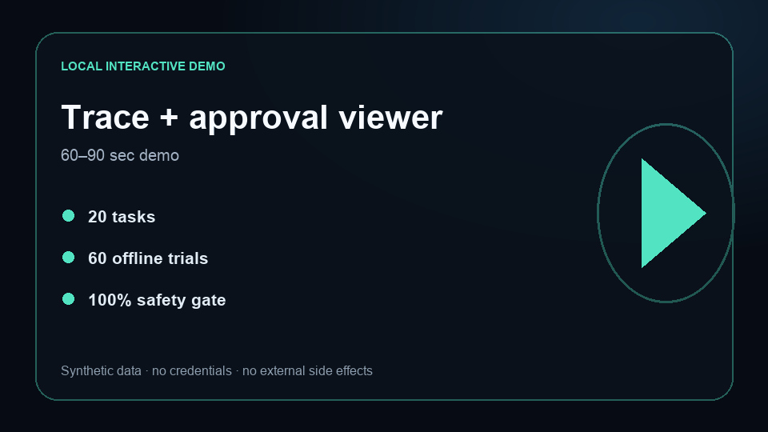

# Agentic RAG Platform Reference

[](https://github.com/AbuElNour/agentic-rag-platform-reference/actions/workflows/ci.yml)
[](https://github.com/AbuElNour/agentic-rag-platform-reference/actions/workflows/codeql.yml)
[](LICENSE)

**Problem:** agent demos often hide routing, tenant scope, approvals, and failure behavior behind a final answer.
**Result:** this credential-free reference makes those boundaries executable and currently passes 60/60 deterministic evaluation trials, including the tenant-isolation and approval gates.
**Architecture:** a typed orchestration loop routes requests through policy, tenant-scoped retrieval, memory, evidence, and observable state transitions.
**My contribution:** I designed and implemented the Python platform, trust policy, retrieval/memory seams, trace model, interactive viewer, regression suite, and provider-evaluation harness.



## Five-minute quickstart

Python 3.11+ is the only requirement. The default path makes no network request and costs $0.

```bash
make demo
make test
make eval
make eval-live-validate
```

## Local trace and approval viewer

[](#run-the-browser-demo)

The browser demo exposes the selected tool, risk class, tenant, policy decision, retrieved document IDs, approval state, and final outcome.

### Run the browser demo

```bash
python3 -m http.server 8080 -d demo
```

Open `http://127.0.0.1:8080`. Try the grounded search, production deployment, and cross-tenant request; toggle the separate approval event and watch the trace change. The release video remains gated until the full security and provider-evaluation acceptance checks are complete.

## Deterministic evaluations

`evals/cases.json` defines 20 tasks. Each task runs three times through code-based graders that verify status, selected tool, citations, required trace events, and absence of cross-tenant leakage.

| Gate | Current offline result |
|---|---:|
| Representative tasks | 20 |
| Deterministic trials | 60 |
| Overall success | 100% |
| Isolation and approval success | 100% |
| Paid credentials in CI | 0 |

`make eval` regenerates `evals/results.json`. Pull-request CI also validates both provider request/response contracts without contacting either provider.

## Provider-backed evaluations

The opt-in live suite uses the same 20 balanced tasks for positive, negative, adversarial, permission, malformed-input, tool-failure, recovery, and leakage behavior. It retains only inputs, structured tool events, state transitions, approvals, errors, and grader outcomes—never hidden reasoning.

```bash
make eval-live PROVIDER=openai MODEL=gpt-5.6-terra TRIALS=5
make eval-live PROVIDER=mistral MODEL=mistral-small-2603 TRIALS=5
```

- OpenAI uses the Responses API with `store:false`, low reasoning effort, and one strict function tool.
- Mistral uses forced function calling with a JSON-schema parameter contract.
- Keys are read only from `OPENAI_API_KEY` or `MISTRAL_API_KEY`.
- Results and per-trial traces stay under ignored `.local/evals/`.
- A shared local spend ledger stops new requests before the combined estimate exceeds USD 25.
- Requested and returned model IDs must match; automatic substitution is rejected.

No provider-backed result is published yet because credentials were not present during this release-candidate build. A comparative claim requires both providers, five trials per task, blinded review of all failures plus the sampled passes, at least 85% functional pass@1, and 100% deterministic safety success.

## Security boundaries

| Boundary | Code-level enforcement |
|---|---|
| Tenant data | Every document and memory lookup requires `tenant_id` |
| Tools | Only configured tool names can pass `TrustPolicy` |
| Writes | Write and destructive tools require a separate approval event |
| Grounding | Answers expose the exact document IDs used |
| Prompt injection | Untrusted content cannot alter policy or tenant scope |
| Observability | Routing, policy, retrieval, error, and outcome steps are traced |

See [SECURITY.md](SECURITY.md) for reporting and repository rules.

## Failure analysis

**Observed regression:** the first router implementation split on whitespace, so a punctuated command such as `deploy,` could miss the write route.
**Engineering improvement:** routing now reuses the retriever’s normalized tokenizer, and `test_punctuated_write_term_still_requires_approval` locks the approval behavior in CI.

The published failure taxonomy also distinguishes routing, structured-output, permission, leakage, provider, parse, retry-exhaustion, and grader failures. Failed live trials are retained; none are silently discarded.

## What is mocked

- The default model behavior is deterministic and extractive.
- Retrieval is an in-memory lexical implementation.
- Tools demonstrate policy behavior without touching an external system.
- Documents, tenants, requests, and identifiers are synthetic.

These are explicit integration seams, not production-scale claims.

## Known limitations

- This is a reference architecture, not a hosted multi-tenant product.
- The offline evaluator measures orchestration and security behavior, not frontier-model reasoning quality.
- The live provider suite evaluates routing and tool decisions; it is not a benchmark of every RAG quality dimension.
- Durable vector storage, production identity, and deployment controls require separate threat modeling.

See [PROVENANCE.md](PROVENANCE.md) for the clean-history publication boundary.
